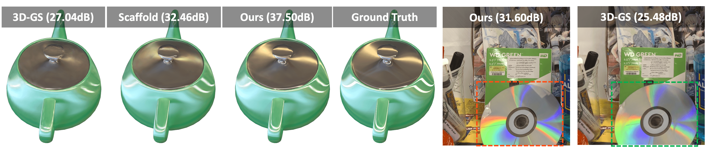
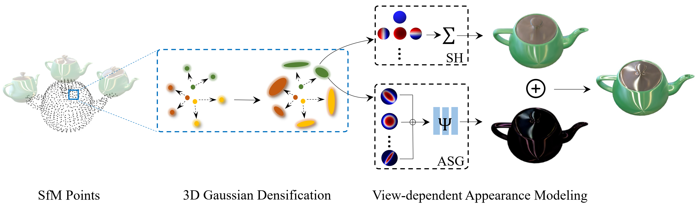
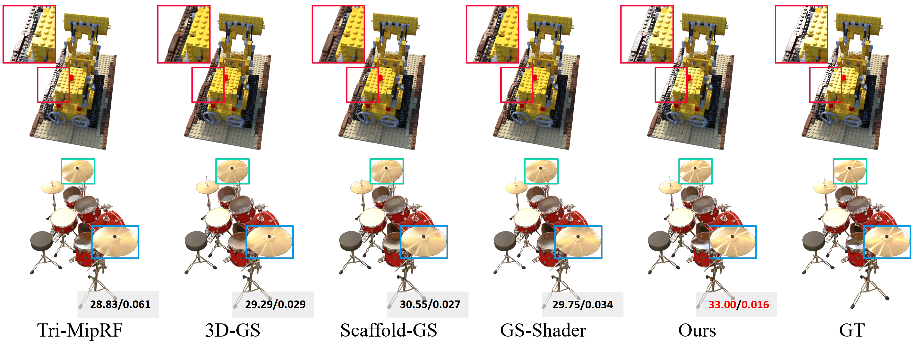
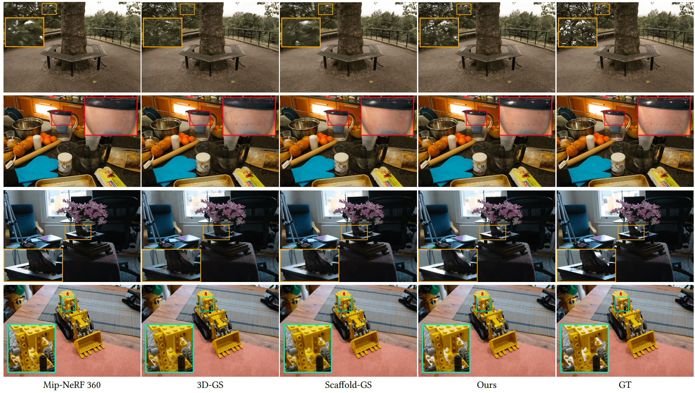
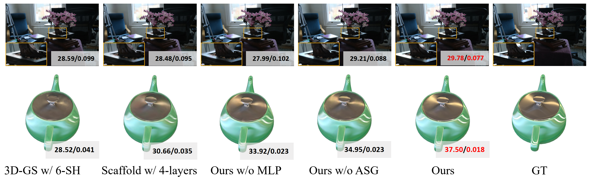
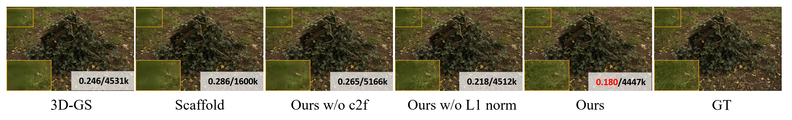

# Spec-Gaussian: Anisotropic View-Dependent Appearance for 3D Gaussian Splatting

## [Project Page](https://ingra14m.github.io/Spec-Gaussian-website/) | [Paper](https://arxiv.org/abs/2402.15870) | [Anisotropic Dataset](https://drive.google.com/drive/folders/1hH7qMSbTyR392PYgsqeMhAnaAxwxzemc?usp=drive_link)



This project was built on my previous released [My-exp-Gaussian](https://github.com/ingra14m/My-exp-Gaussian), aiming to enhance 3D Gaussian Splatting in modeling scenes with specular highlights. I hope this work can assist researchers who need to model specular highlights through splatting.


**Note** that the current Spec-Gaussian has significantly improved in quality compared to the first version on arxiv (2024.02). Please pay attention to the latest version on arxiv.

## News

- **[11/15/2024]** Update the training scripts for current version.
- **[9/26/2024]** Spec-Gaussian has been accepted by NeurIPS 2024. We also release our anisotropic dataset [here](https://drive.google.com/drive/folders/1hH7qMSbTyR392PYgsqeMhAnaAxwxzemc?usp=drive_link).


## Dataset

In our paper, we use:

- synthetic dataset from [NeRF](https://drive.google.com/drive/folders/128yBriW1IG_3NJ5Rp7APSTZsJqdJdfc1), [NSVF](https://dl.fbaipublicfiles.com/nsvf/dataset/Synthetic_NSVF.zip), and our [Anisotropic Synthetic Dataset](https://drive.google.com/drive/folders/1hH7qMSbTyR392PYgsqeMhAnaAxwxzemc?usp=drive_link)
- real-world dataset from [Mip-NeRF 360](https://jonbarron.info/mipnerf360/).

And the data structure should be organized as follows:

```shell
data/
├── NeRF
│   ├── Chair/
│   ├── Drums/
│   ├── ...
├── NSVF
│   ├── Bike/
│   ├── Lifestyle/
│   ├── ...
├── Spec-GS
│   ├── ashtray/
│   ├── dishes/
│   ├── ...
├── Mip-360
│   ├── bicycle/
│   ├── bonsai/
│   ├── ...
├── tandt_db
│   ├── db/
│   │   ├── drjohnson/
│   │   ├── playroom/
│   ├── tandt/
│   │   ├── train/
│   │   ├── truck/
```


## Pipeline




## Run

### Environment

```shell
git clone https://github.com/ingra14m/Spec-Gaussian --recursive
cd Spec-Gaussian

conda create -n spec-gaussian-env python=3.7
conda activate spec-gaussian-env

# install pytorch
pip install torch==1.13.1+cu116 torchvision==0.14.1+cu116 --extra-index-url https://download.pytorch.org/whl/cu116
pip install torch-scatter -f https://data.pyg.org/whl/torch-1.13.0+cu116.html

# install dependencies
pip install -r requirements.txt
```


### Train

We have provided scripts [`run_wo_anchor.sh`](https://github.com/ingra14m/Spec-Gaussian/blob/main/run_wo_anchor.sh) and [`run_anchor.sh`](https://github.com/ingra14m/Spec-Gaussian/blob/main/run_anchor.sh) that were used to generate the table in the paper.

In general, using the version without anchor Gaussian can achieve better rendering effects. Using the version with anchor Gaussian can achieve faster training and inference. For researchers who want to explore the use of Spec-Gaussian, we have provided the following general training command.

**Train without anchor**

```shell
python train.py -s your/path/to/the/dataset -m your/path/to/save --eval

## For synthetic bounded scenes
python train.py -s data/nerf_synthetic/drums -m outputs/nerf/drums --eval

## For real-world unbounded indoor scenes
python train.py -s data/mipnerf-360/bonsai -m outputs/mip360/bonsai --eval -r 2 --is_real --is_indoor --asg_degree 12

## For real-world unbounded outdoor scenes
python train.py -s data/mipnerf-360/bicycle -m outputs/mip360/bicycle --eval -r 4 --is_real --asg_degree 12
```


**[Extra, for acceleration] Train with anchor**

```shell
python train_anchor.py -s your/path/to/the/dataset -m your/path/to/save --eval

## For synthetic bounded scenes
python train_anchor.py -s data/nerf_synthetic/drums -m outputs/nerf/drums --eval --voxel_size 0.001 --update_init_factor 4 --iterations 30_000

## For mip360 scenes
python train_anchor.py -s data/mipnerf-360/bonsai -m outputs/mip360/bonsai --eval --voxel_size 0.001 --update_init_factor 16 --iterations 30_000 -r [2|4]
```


## Results

### Synthetic Scenes




### Real-world Scenes




### Ablation






### Align with Rip-NeRF

The Tri-MipRF and Rip-NeRF use both train and val set and the training data. I provided the results on NeRF-synthetic dataset with the same setting.
| Scene     | PSNR   | SSIM      | LPIPS    |
| --------- | ------ | --------- | -------- |
| chair     | 37.33  | 0.9907    | 0.0088   |
| drums     | 28.50  | 0.9669    | 0.0288   |
| ficus     | 38.08  | 0.9922    | 0.0081   |
| hotdog    | 39.86  | 0.9895    | 0.0148   |
| lego      | 38.44  | 0.9876    | 0.0121   |
| materials | 32.64  | 0.9738    | 0.0285   |
| mic       | 38.57  | 0.995     | 0.0045   |
| ship      | 33.66  | 0.9248    | 0.0906   |
| Average   | **35.89** | **0.9776** | **0.0245** |
| Rip-NeRF   | 35.44 | 0.973 | 0.037 |


## Acknowledgments

This work was mainly supported by ByteDance MMLab. I'm very grateful for the help from Chao Wan of Cornell University during the rebuttal.


## BibTex

```shell
@article{yang2024spec,
  title={Spec-Gaussian: Anisotropic View-Dependent Appearance for 3D Gaussian Splatting},
  author={Yang, Ziyi and Gao, Xinyu and Sun, Yangtian and Huang, Yihua and Lyu, Xiaoyang and Zhou, Wen and Jiao, Shaohui and Qi, Xiaojuan and Jin, Xiaogang},
  journal={arXiv preprint arXiv:2402.15870},
  year={2024}
}
```

And thanks to the authors of [3D Gaussians](https://repo-sam.inria.fr/fungraph/3d-gaussian-splatting/) and [Scaffold-GS](https://github.com/city-super/Scaffold-GS) for their excellent code, please consider citing these repositories.
